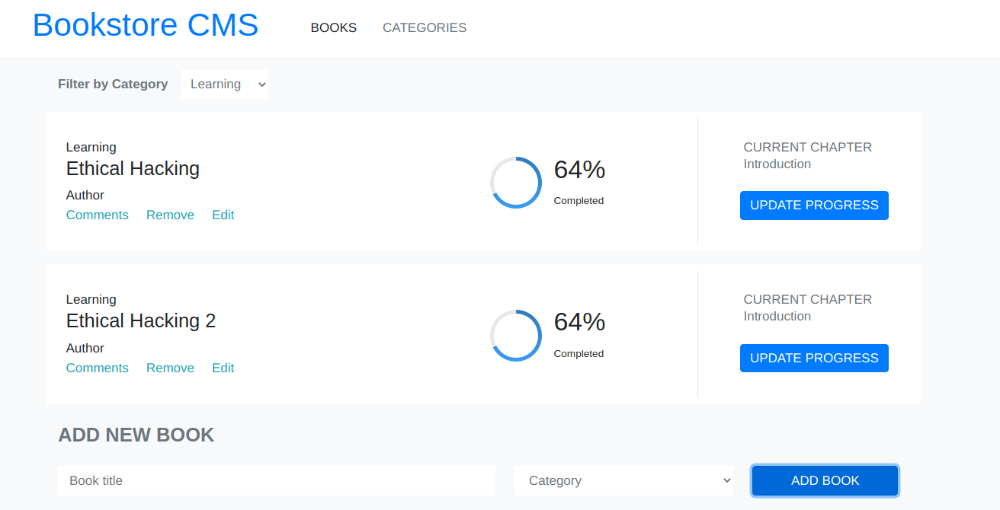

# Redux-Book-Store

> In this project we developed a Bookstore App to save books with their title and category. We can also filter the books by categories or remove them from the bookstore.



## Built With

- Javascript ES6
- React
- Redux
- Bootstrap
- HTML
- CSS
- VS Code

## Live Demo

> Check this app on this [Live demo link](http://redux-bookstore-373.herokuapp.com/)

## How to Install

- Install Node in your system. To install Node, you can read the [Documentation](https://nodejs.org/en/download/package-manager/)
- Clone the repo or download the zip file into your machine. 
    ``` 
   git clone https://github.com/Miguelus373/React-Calculator.git
    ``` 
- On your terminal, CD into the React-Calculator folder and run
    ``` 
   npm install
    ``` 
- This will install all the dependancies.

- Then run 
    ``` 
   npm start
    ``` 
- This will start a local server that you can access with [This Link](http://localhost:3000/) on your browser

### Milestone-6

- In order for this to be a full application, it needs to connect it with a backend that can store all the information about the books that user owns. 
- It needs to create a new Ruby on Rails application, it
will be a simple REST API, which should:
 - 1. To allow the user to obtain a list of books in your library
 - 2. To allow the user to remove a book from your library
 - 3. To allow user to add a book to your library
 - 4.Each book should have a title, author (blank by default), and a Category
 - 5. This React/Redux app should make GET/POST/PUT requests to this Rails API to obtain and save data
 - 6. In order to make things simple for now, it needs to deploy the React app and the Rails app as two separate apps

## Authors  

👤 **Oksana Petrova**

- Github:[@Laguna1](https://github.com/Laguna1)
- Linkedin: [Oksana Petrova](https://www.linkedin.com/in/oksana-petrova/)
- Twitter: [Oksana Petrova](https://twitter.com/OksanaP48303303) 

👤 **Miguel Uzcátegui**

- Github: [@miguelus373](https://github.com/miguelus373)
- Linkedin: [Miguel-Uzcátegui](https://www.linkedin.com/in/miguelus/)


## 🤝 Contributing

Contributions, issues and feature requests are welcome!. Feel free to check the [issues page](https://github.com/Miguelus373/Redux-Book-Store/issues).

## Show your support

Give a ⭐️ if you like this project!

## 📝 License
This project is [MIT](https://github.com/Miguelus373/Redux-Book-Store/blob/develop/LICENSE) licensed.